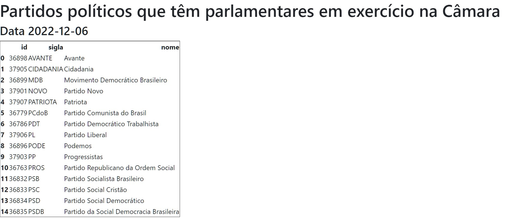

# Analise de dados abertos da camara de deputados

Este respositorio tem como objetivo juntos conhecimentos de back-end e front-end. Para isto:

- Consumir a API's para ter acesso aos dados aberto da Camara dos Deputados atualizados diariamente.
- Tratar os dados.
- Apresentar os dados via navegador localhost.

Atualmente é apresentado no navegador a seguinte informação:

